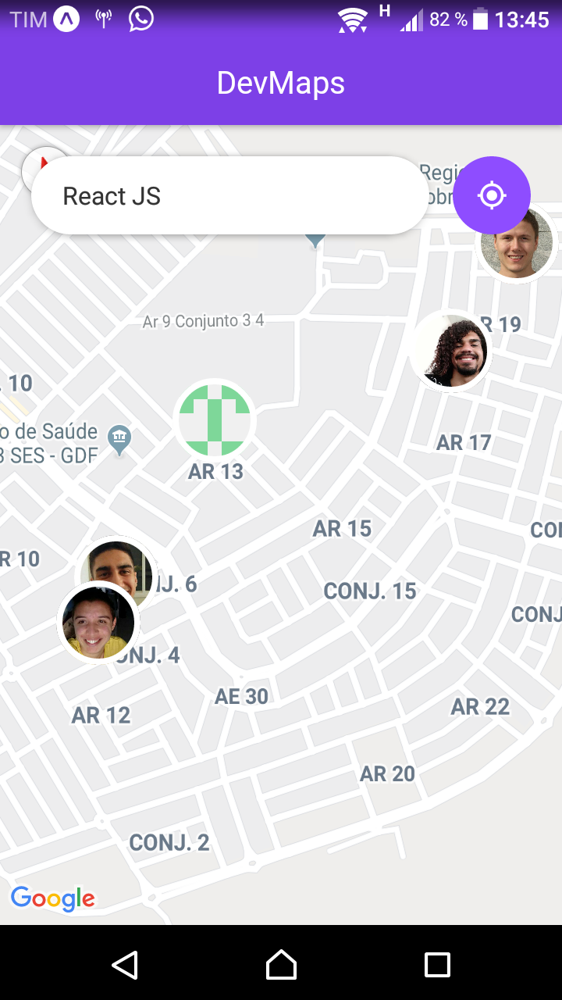

# Devs-Network
## What this is about
This is a repository about registration and search for developers like a social media, e.g.: Tinder and iFood.

## Technical stuffs
Devs Network is made by ReactJS, ReactNative and NodeJS. It's a simple exercise for learn new techs. 
<ul>
    <li>How to run backend:
        
yarn nodemon index.js

    </li>
    <li>How to run frontend:
        
yarn start

    </li>
    <li>How to run mobile:
        
First, download the app Expo in Google Play Store or Apple Store. After, run yarn start in your terminal, a new page will open in your browser. Now, in your phone follow the steps described on that page. The JavaScript bundle will building. Make sure to activate the GPS when will necessary.

    </li>
</ul>